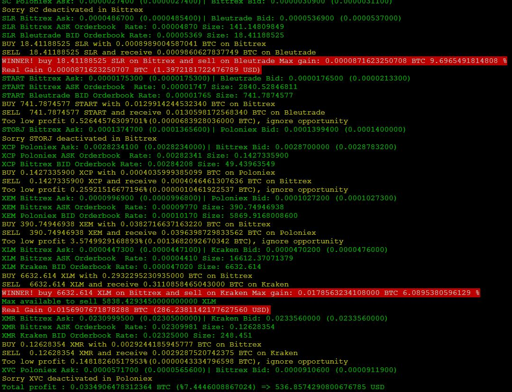
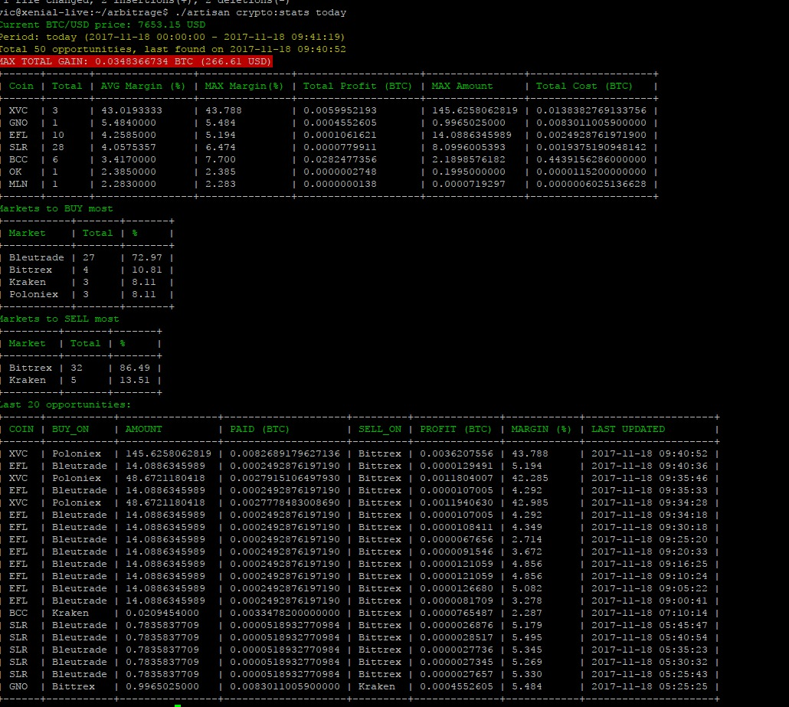

Crypto Lara Arbitrage
--- 

Implements basic arbitrage algorithm between crypto exchange markets,  currently supported : Bittrex, Poloniex, Bleutrade and Kraken.

## Features

* support for multiple crypto exchange platforms
* check the ask / bid size in orderbook  to adjust realistically the maximum gain
* supports full exposure (use the order max size) or fixed stake
* log the opportunities found in DB and display statistics
* simulate the transactions based on the existing funds in the wallets and track them to get a P/L balance
* wallets portfolio from all the exchange markets
* initialize the wallets based on previous opportunities found
* balance the funds between markets automatically 
* simulate basic trading operations (buy, sell, deposit, withdraw)

## Disclaimer
   
   This software is for educational purposes only, _right now it's just a simulator, meaning no real money involved_. 
   
  __Anyway, as a general rule if you decide to follow the opportunities, DO NOT risk money which you are afraid to lose.__ USE THE SOFTWARE AT YOUR OWN RISK. THE AUTHORS AND ALL AFFILIATES ASSUME NO RESPONSIBILITY FOR YOUR TRADING RESULTS.

## Instalation

Download or clone the repository:

    git clone https://github.com/vicxyz1/crypto-lara-arbitrage.git

Install dependencies: 
    
    cd crypto-lara-arbitrage/
    composer install

Simplify _artisan_ commands execution by giving the rights:

    chmod a+x artisan 

Create initial wallets funds:

    cd config
    cp wallets.json.example wallets.json

Create the MySQL database and configure settings in the .env file:  

    cp .env.example .env

Run migrations and seeders:

    ./artisan migrate
    ./artisan db:seed
    
    ./artisan key:generate 

Optionally, install the cron to run the arbitrage bot in the background:

    * * * * * php /path/to/project/artisan schedule:run >> /dev/null 2>&1

## Basic Usage

Run the arbitrage bot:

    ./artisan arbitrage:run

  
Display arbitrage statistics:

    ./artisan arbitrage:stats 
    

__Wallet management__

   - Display all the wallets with a positive balance and the total value in BTC/USD
    
    ./artisan wallet:portfolio
    
   - Display summary of transactions and P&L report
   
    ./artisan wallet:transactions
   
   - Balance funds between platforms
   
    ./artisan wallet:balance
    
Each command supports additional options, please check them with:   
    
    ./artisan help {command}

## Contributing

Feel free to contribute, but please discuss the feature in a issue or contact me before a PR 
    

